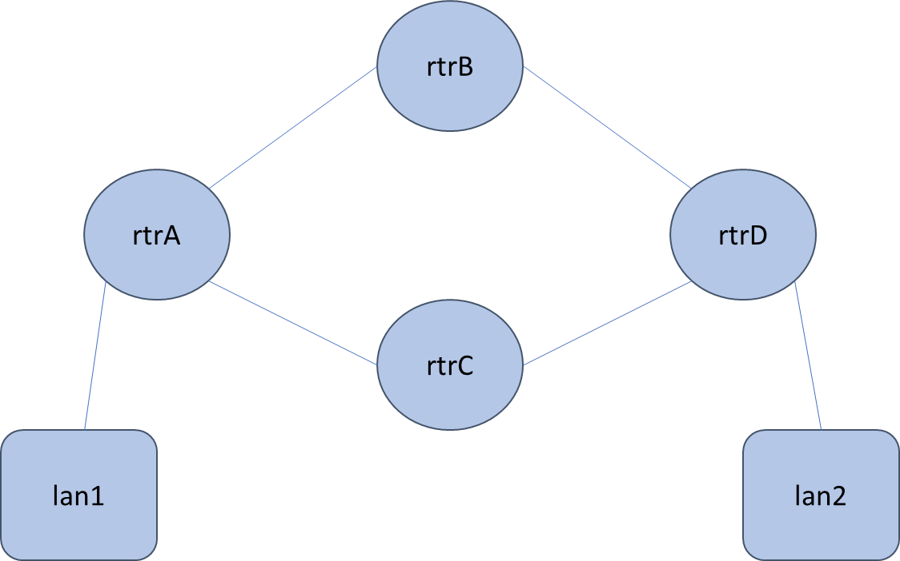

# Introduction

Illustrates how a router, specifically [bird](https://bird.network.cz/), can be used to set up the routing tables in Linux.

# Topology Setup

Provided is a containerlab topology configuration file called diamond-mod2.clab.yml, with the topology named mod2-bgp.



```
sudo containerlab deploy
```
Note: when you are done and want to teardown the lab setup, run `sudo containerlab destroy`

Also provided is a script that will set aliases for the docker commands to execute commands inside of each container.

```
source make_aliases.sh
```

Also provided is a script that will setup the IP addresses for each interface in the topology.  Note: if you are adventurous, you can modify the containerlab configuration file to set the IP addresses.  But, since we're also learning about using Linux commands, we'll provide it as a set of Linux commands. 

```
./setup-ip-diamond.sh create
```


# Start Bird in rtrA-rtrD

Once the topology is set up, you can run the router (bird) in each of the rtr containers.  A script is provided to simplify this, but certainly look init.

```
./start-bird.sh
```

Some important things of note.  When you run bird, there's either a default configuration filea (/etc/bird/bird.conf) or you can specify to use a custom one.  We specify a custom one for each router, so you'll see a line like this in the start-bird.sh script, which runs bird with the alternative config file (/etc/bird-alt/rtrA-bird.conf).

```
$rtrA bird -c /etc/bird-alt/rtrA-bird.conf
```

In the diamond-mod2.clab.yml file, you'll note that we have a bind statement for each of the routers that bind mod2-bird-confs (the local directory on the host) to /etc/bird-alt (inside of the container).


# Things to Do

## show routing tables / protocol status

```
rtrA birdc show protocols
rtrA birdc show route all
```

note two routes, it chose 1


## Ping and traceroute between lan1 and lan2
```
lan1 ping -I 1.1.1.1 4.4.4.4
lan1 traceroute -s 1.1.1.1 4.4.4.4
```

## Fail an interface and see BGP change paths

Whichever path it is taking (seen with traceroute), fail an interface to force it to take the other.  Say rtrB was on path, bring down an interface on that router.

```
rtrB ip link set eth1 down
```

Now, when you traceroute, you should see it taking a different path.

```
lan1 traceroute -s 1.1.1.1 4.4.4.4
```

You can show routing tables / protocol status for rtrA again.  The routing table should have changed.
```
rtrA birdc show protocols
rtrA birdc show route all
```

To show it recovering, you can bring interface back up
```
rtrB ip link set eth1 up
```

Note it takes some time (because BGP is based on timers), and it may not choose that route, but you can see the routing tables for rtrA again to see it in there eventually.

```
rtrA birdc show protocols
rtrA birdc show route all
```


